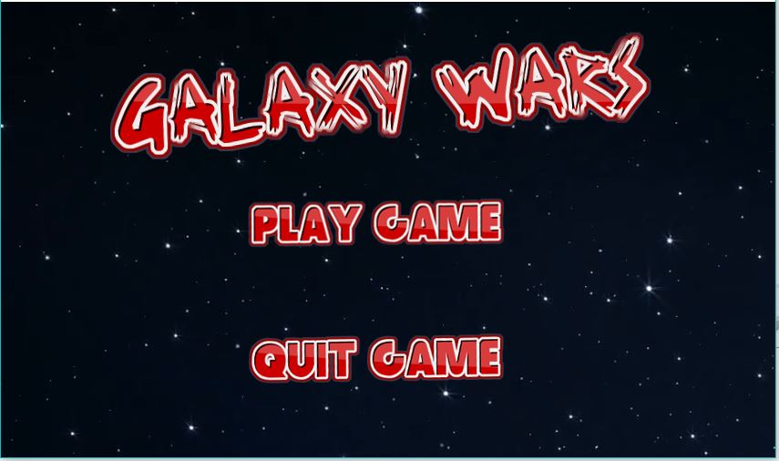
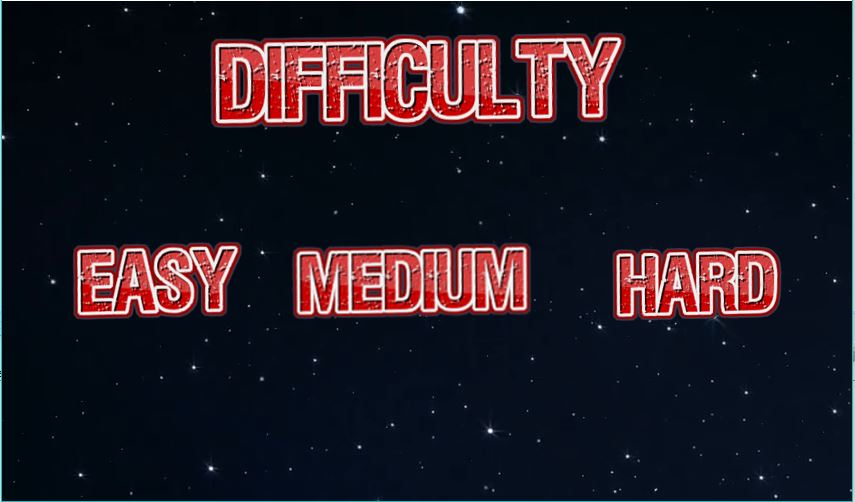
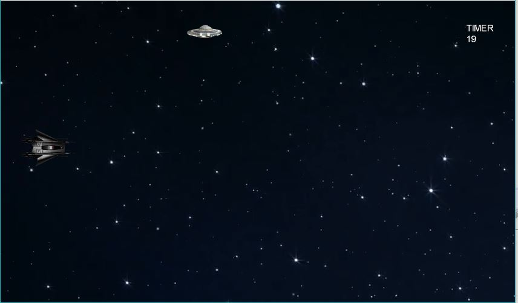
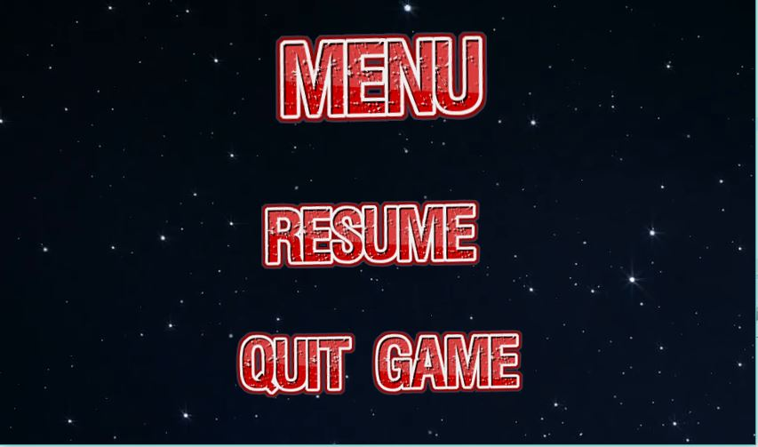

# GalaxyWars

## Introduction

**Galaxy Wars** is a game that consists in a space ship that continuously tries to reach further distance until infinity. The main objective of the game is to last for the longest time possible. 
The game consists in three different difficulties (easy, medium, hard) differing of the quantity of enemies being thrown at.

## User Manual

* **Main Menu**
Once the game is launched, the user can select:
	* **New Game**  
	Initializes the screen with two options. Play game or quit game. If play game option is chosen it redirects to difficulty choice menu.

	* **Difficulty Choice Menu**  
		Gives the user three options of difficulty:
		* Easy
		* Medium
		* Hard

	* Action  
	After the user choice of the game difficulty the game will start being the user the spaceship in the left and the enemies are all of the bodies coming from the right.
	

	
* **Controls**
	* **"W"**  
	Gives the player's spaceship an upwards impulse (must be pressed repeatedly)

	* **"S"**  
	Gives the player's spaceship a downwards impulse (must be pressed repeatedly)

* **Enemies**

	There are 3 different tipes of enemies:
	* ZigZag
	Bounces up and down unpredictably while moving left towards the player  
	

	* Shooter
	Fires projectiles while trying to aim at the player  
	

	* Kamikaze
	Tries to lock the player's altitude and then quickly launches itself towards him.  
	
	

	If any of the enemyes collide with the player, the game is over. 
	
	The player can pause the game at any point by pressing "esc", entering the pause menu:
	
* **Pause menu**
	

## Design Patterns

	* **Model View Controller**
		To make testing easier and the code more organized. 

	* **Object Pool**
		This design pattern is used to save memory and improve the performance when firing the projectiles, as they exist in a limited amount and are contantly being created and destroyed. It was also used in the creation of the different enemies.

	* **Singleton**
		It's implemented in the GameModel class.

## Major Difficulties
The major difficulties we encountered during the development of the project was the making of of the explosions animation due to the fact that we couldn't keep the correct time between the changing of the frames of the animation.  
We also had a difficult time dealing with the buttons interface because they were all "handmade" which means we had to keep scaling and changing the images.  
The last major difficulty we have faced was the implementation of the singleton design pattern as there were times that we had to access to variables in a non-static way forcing us to change the implementation.  
## Lessons Learned
We have learned that the design patterns are essential for a good, organized project. They help to maintain the sustainability of the code aswell as adding new modifications or even refactoring the code. This was something that we had valued since the beginning of the project allowing us to organize and create a better project.
