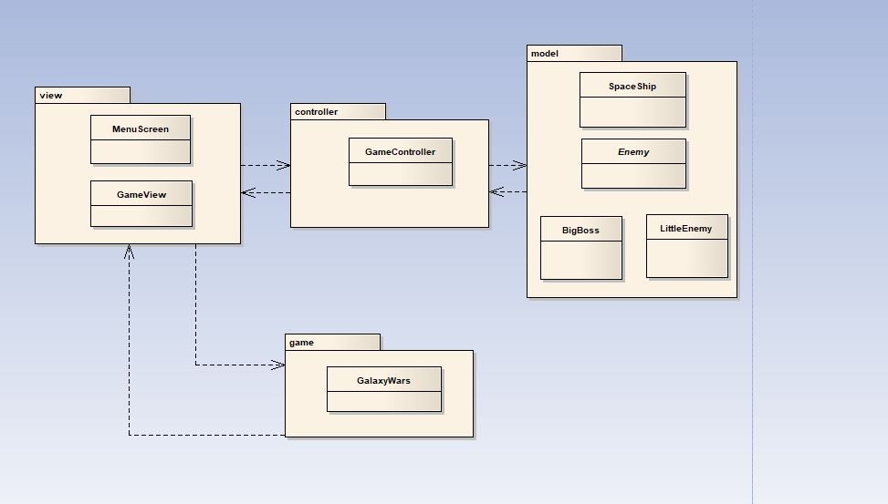

# GalaxyWars

## Introduction

**Galaxy Wars** is a game that consists in a space ship that continuously tries to reach further distance until it reaches the ultimate BOSS who it shall fight and destroy it.
Throughout the game the player will find himself surrounded by enemies which he has to kill to reach the final stage of the game.

## Architecture Design

Below is a representation of the diagram representing our program structure.

### Design Patterns
* Singleton : for GameModel, GameController and GameView

---

## GUI Design

* **Main functionalities**
  
  * Highest scores record
  * Game difficulty choice
  * Volume mixer

* **GUI mock-ups**

The next images are just a sketch of what the game interface should be as we haven't defined a gui that we find appropriate. 

This first image is a representation of the first "level" of the game.

This image represents the obstacles in the game.

This last image is the representation of the last "level" of the game.

---

## Test Designs

* **Button testing**
  * Galaxy "jumps" when space bar is pressed
  * Galaxy "fires" bullet when right button is clicked
  
* **Enemy testing**
  * "Boss" enemy dies when its health is "0"
  * Galaxy wins game when "BOSS" enemy is defeated
  
* **Collision testing**
  * Galaxy "dies" when it colides with the floor
  * Galaxy loses health when bullet hits it
  * Galaxy "dies" when enemy collides with it
  * Galaxy "dies" when plasma ball collides with it

## User Manual

* **Main Menu**
Once the game is launched, the user can select:
	* New Game
	Witch starts the game

	* Quit Game
	Witch exits the game

* **Controls**
	* Space
	Gives the player's spaceship an impulse (must be pressed repeatedly)

	* Enter
	Fires a projectile to the right

* **Game cicle**
	At the start of the game, the user must keep his spaceship from falling down, hitting the ground will cause the player's death.
	There are 3 different tipes of enemies:
	* ZigZag
	Bounces up and down unpredictably while moving left towards the player
	

	* Shooter
	Fires projectiles while trying to aim at the player
	

	* Kamikaze
	Tries to lock the player's altitude and then quickly launches itself towards him.
	
	

	If any of the enemyes collide with the player, the game is over. 
